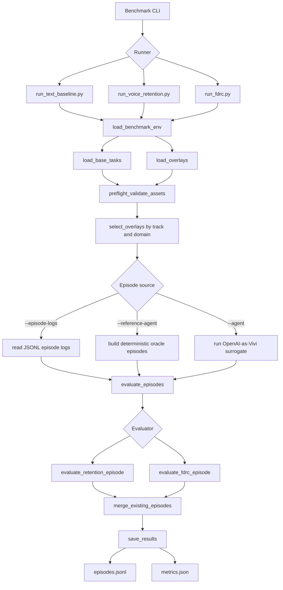
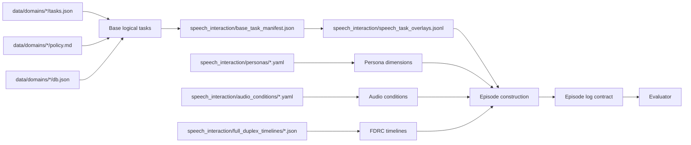
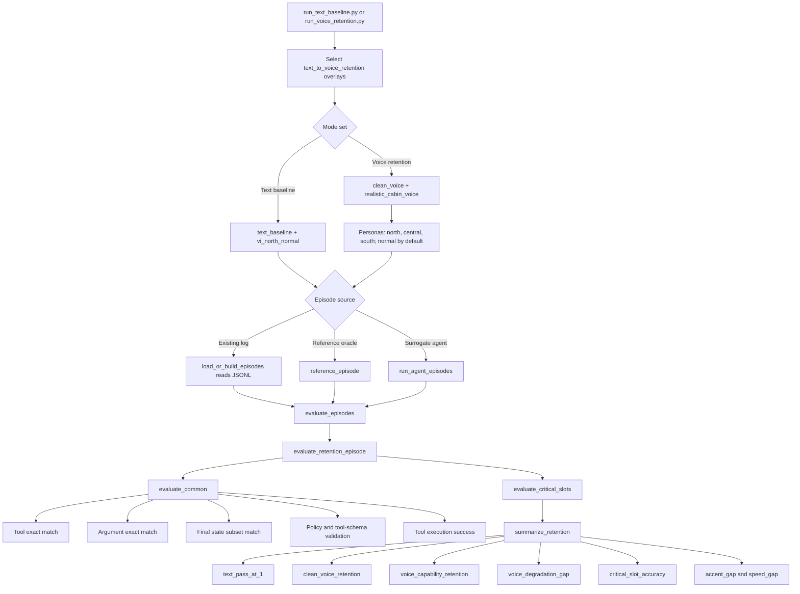
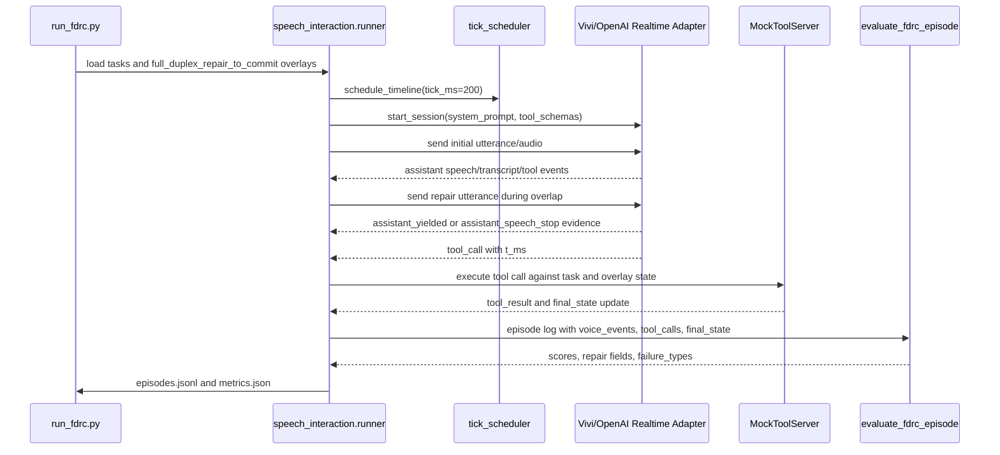
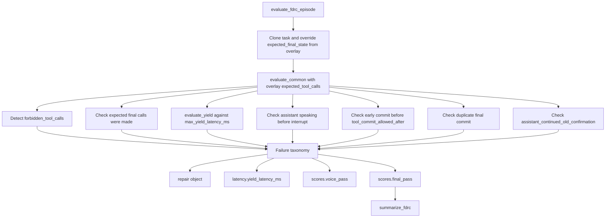
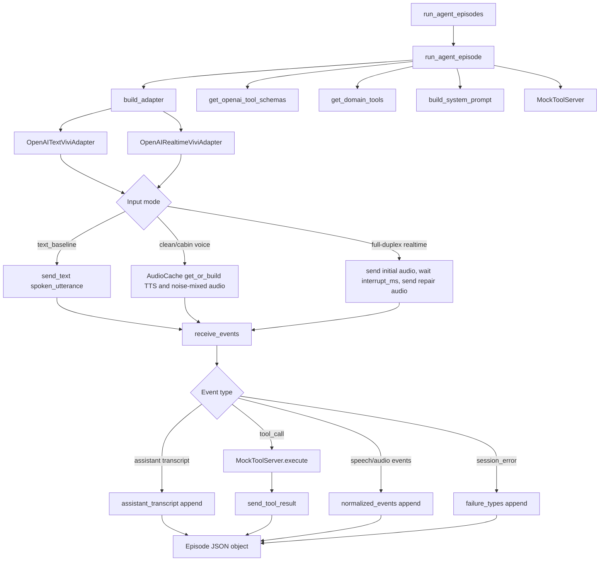
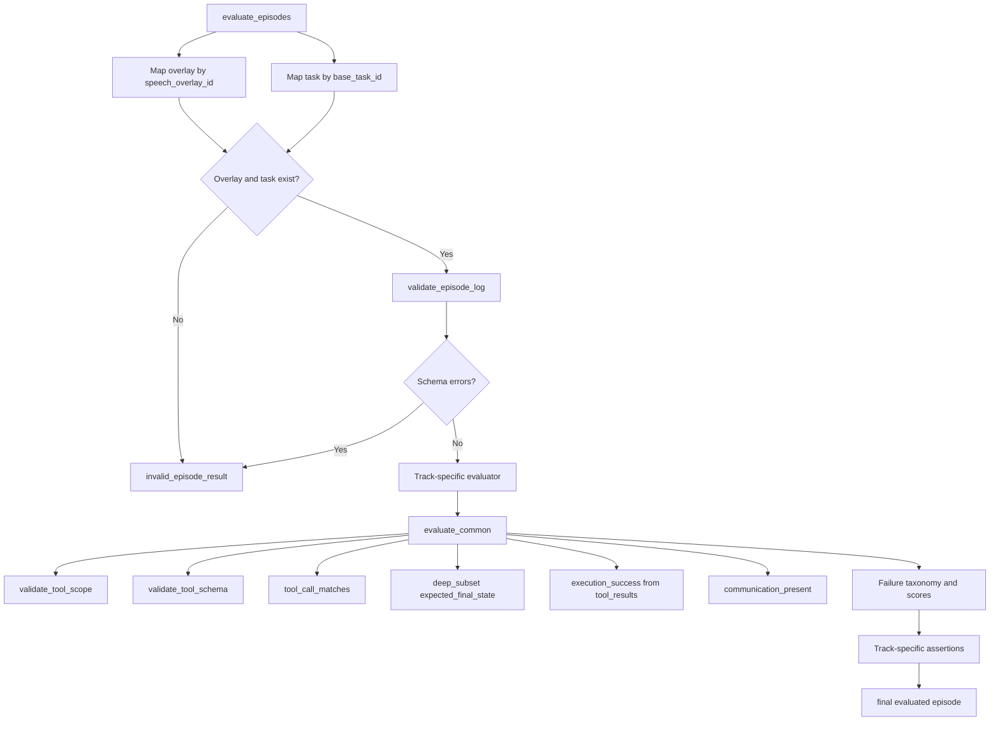
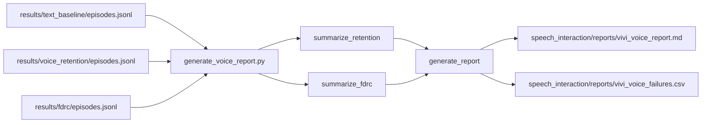

# Luồng Hoạt Động Benchmark Và Evaluation

## Context

Repository này triển khai **Vivi-τVoice-CarBench-VN**, một benchmark tương tác giọng nói tiếng Việt trong bối cảnh ô tô. Hệ thống tách rõ hai miền trách nhiệm: tầng sinh hoặc tiếp nhận episode log và tầng evaluation tất định. Thiết kế này giúp giảm nhiễu đo lường từ hạ tầng agent, đồng thời giữ evaluator đủ độc lập để chấm log từ Vivi thật, surrogate OpenAI, hoặc `reference-agent`.

| Thành phần | File chính | Vai trò |
|---|---|---|
| Text baseline runner | `run_text_baseline.py` | Chấm retention task ở chế độ text để tạo năng lực nền. |
| Voice retention runner | `run_voice_retention.py` | Chấm cùng task retention trong điều kiện voice sạch và voice cabin. |
| Full-duplex runner | `run_fdrc.py` | Chấm khả năng bị ngắt lời, sửa hoặc hủy ý định, và chỉ commit ý định cuối. |
| Runner core | `speech_interaction/runner.py` | Chọn overlay, tạo hoặc đọc episode, validate schema, gọi evaluator, ghi kết quả. |
| Agent orchestrator | `speech_interaction/orchestrator/full_duplex_orchestrator.py` | Chạy agent thật qua adapter, gửi text/audio/timeline, nhận tool call, thực thi tool mock. |
| Retention evaluator | `speech_interaction/evaluator/retention_evaluator.py` | Chấm tool, state, policy, critical spoken slots, retention metrics. |
| FDRC evaluator | `speech_interaction/evaluator/fdrc_evaluator.py` | Chấm correction uptake, old-intent suppression, yield latency, commit timing. |
| Report generator | `generate_voice_report.py` | Gộp kết quả retention và FDRC thành báo cáo tổng hợp. |

## Problem Statement

Benchmark cần trả lời ba câu hỏi kỹ thuật, không chỉ đo transcript hoặc ASR:

1. Agent có giữ được năng lực task-grounded khi chuyển từ text sang voice hay không.
2. Agent có chịu tác động tiêu cực bởi cabin noise, accent region, speech speed, và điều kiện tương tác căng thẳng hay không.
3. Agent có xử lý full-duplex đúng policy, tức là nhường lời khi bị ngắt, tiếp nhận repair utterance, không commit ý định cũ, và chỉ commit ý định cuối hay không.

## Technical Deep-Dive

### Luồng Tổng Quan

### Luồng Dữ Liệu Benchmark

| Artifact | Semantic ownership | Evaluation impact |
|---|---|---|
| `tasks.json` | Logical user goal, initial state, expected tool trajectory, expected final state. | Determines task correctness, state match, and expected tool calls. |
| `policy.md` | Domain policy boundary. | Policy violations reduce `policy_pass` and `final_pass`. |
| `db.json` | Domain state fixture. | Used through task/tool execution semantics and final state comparison. |
| `base_task_manifest.json` | Normalized index over selected benchmark tasks. | Binds speech overlays to canonical logical tasks. |
| `speech_task_overlays.jsonl` | Speech utterance, critical slots, audio mode, repair intent, forbidden/expected calls. | Supplies voice assertions and overlay-specific expected outcomes. |
| `audio_conditions/*.yaml` | Clean, cabin noise, interaction stress. | Controls audio generation/mixing for realtime surrogate runs. |
| `full_duplex_timelines/*.json` | Timestamped interaction events. | Enables deterministic yield and commit-timing evaluation. |

### Luồng Text-to-Voice Capability Retention

Retention không chỉ so sánh transcript. Episode chỉ pass khi tool selection, argument, final state, policy behavior, execution result, assistant communication, và critical spoken slots cùng đạt. Vì vậy, `voice_capability_retention = cabin_voice_pass_at_1 / text_pass_at_1` đo mức bảo toàn năng lực task-grounded trong điều kiện cabin thực tế, thay vì đo độ giống văn bản bề mặt.

### Luồng Full-Duplex Repair-to-Commit

| FDRC criterion | Signal source | Failure type when violated |
|---|---|---|
| Agent nhường lời khi bị ngắt | `voice_events`, `assistant_yielded`, `yield_latency_ms` | `YIELD_LATENCY_TOO_HIGH` |
| Ý định sửa được tiếp nhận | Expected final tool calls in overlay versus actual `tool_calls` | `CORRECTION_NOT_UPTAKEN` |
| Ý định cũ không bị commit | `forbidden_tool_calls` versus actual `tool_calls` | `FORBIDDEN_TOOL_CALL`, `OLD_INTENT_COMMITTED` |
| Lệnh hủy được tôn trọng | Overlay `final_intent == cancel` and no actual commit | `CANCEL_NOT_RESPECTED` |
| Không commit quá sớm | `tool_commit_allowed_after` versus tool `t_ms` | `POLICY_VIOLATION` |
| Không xác nhận ý định cũ sau repair | `assistant_continued_old_confirmation` event | `POLICY_VIOLATION` |

### Luồng Chạy Agent Surrogate

Surrogate agent không được xem là ground truth. Nó chỉ là adapter để tạo episode log theo cùng contract với Vivi thật. Điểm đáng chú ý về reliability là mọi tool call đều đi qua `MockToolServer`, sau đó evaluator vẫn re-validate tool scope, schema, final state, critical slots, và voice behavior; nhờ vậy lỗi agent không bị che bởi tool execution layer.

### Luồng Evaluation Chung

| Score field | Computation principle | Product interpretation |
|---|---|---|
| `task_pass` | Exact expected tool trajectory, argument subset match, final state match, and successful tool results. | Agent completed the requested in-car action correctly. |
| `policy_pass` | No policy violations and no tool-schema validation errors. | Agent stayed inside official Vivi behavior and tool interface constraints. |
| `voice_pass` | Track-specific voice behavior; always 1 in common evaluator, then overridden by retention/FDRC logic when needed. | Agent preserved speech-critical semantics or full-duplex interaction correctness. |
| `final_pass` | All task, policy, voice, and failure taxonomy checks pass. | Episode is reportable as successful benchmark behavior. |

### Luồng Report Tổng Hợp

## Strategic Recommendations

| Concern | Current design | Recommendation |
|---|---|---|
| Scalability | Runner loops are deterministic and simple, but agent episodes are executed sequentially. | Parallelize at `(overlay, mode, persona)` granularity only after introducing explicit rate-limit controls, output de-duplication, and deterministic retry metadata. |
| Reliability | Evaluation is decoupled from generation and validates schema before scoring. | Preserve JSONL episode contract as the stable boundary; any future Vivi adapter should only replace `ViviAgentAdapter`, not evaluator semantics. |
| Latency | FDRC uses fixed 200 ms ticks and logs `t_ms` on tool calls and voice events. | Keep tick granularity fixed for comparability; report wall-clock latency separately from benchmark timing if realtime API jitter becomes material. |
| Cost-to-serve | `reference-agent` validates plumbing without paid model calls; OpenAI surrogate requires API calls and TTS/audio cache. | Use `reference-agent` in CI, reserve `--agent openai_realtime` for smoke/regression runs, and evaluate production Vivi logs offline whenever available. |
| Evaluation validity | `final_pass` is strict and failure taxonomy is explicit. | Avoid reporting ASR-style metrics as primary KPIs; keep task correctness, tool safety, and repair-to-commit behavior as the benchmark’s authoritative product metrics. |

