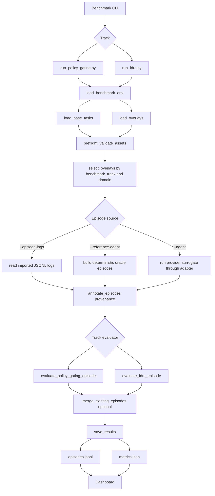
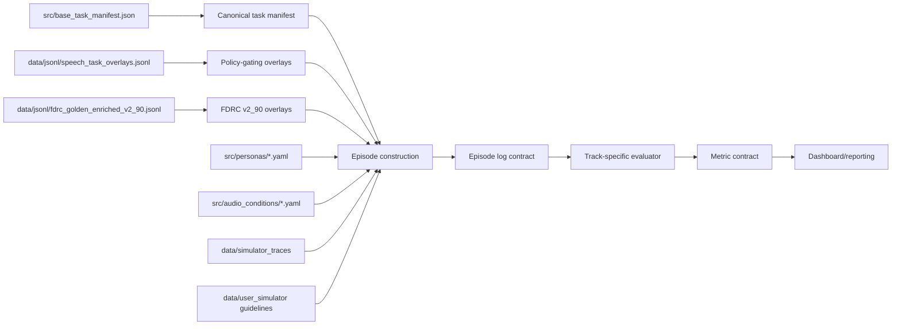
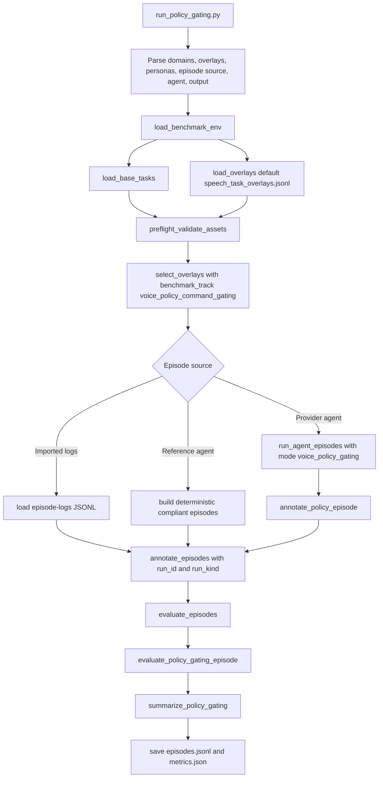
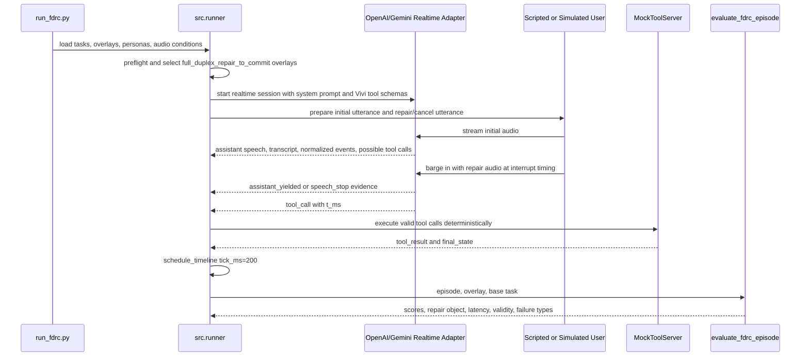
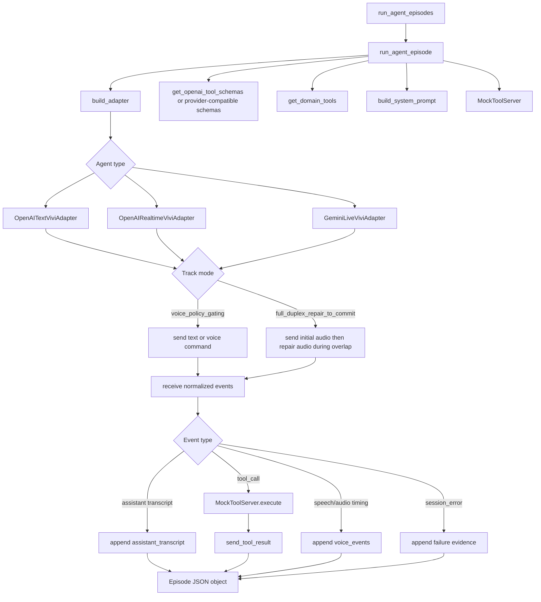
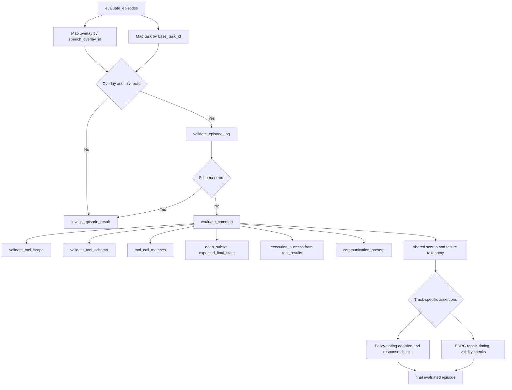
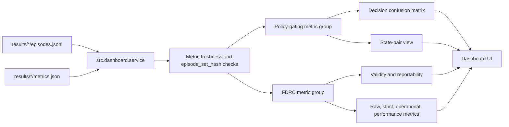

# Luồng Hoạt Động Benchmark Và Evaluation

## Context

Repository này triển khai **Vivi Voice CarBench VN**, một benchmark tương tác giọng nói tiếng Việt trong bối cảnh ô tô. Thiết kế hiện tại không còn lấy Text-to-Voice Capability Retention làm track chính; hai track chuẩn đang được vận hành là **Policy-Grounded Voice Command Gating** và **Full-Duplex Repair-to-Commit**. Cả hai track đều dùng một ranh giới kỹ thuật chung: runner sinh hoặc nhập episode log, còn evaluator chấm điểm tất định dựa trên overlay, task manifest, tool schema, vehicle state, voice evidence, và failure taxonomy.

| Thành phần | File chính | Vai trò |
|---|---|---|
| Policy-gating runner | `run_policy_gating.py` | Chạy benchmark quyết định `execute`, `clarify`, `refuse`, hoặc `defer` theo policy và trạng thái xe. |
| FDRC runner | `run_fdrc.py` | Chạy benchmark ngắt lời, sửa hoặc hủy lệnh trước khi commit side effect. |
| Runner core | `src/runner.py` | Load task, chọn overlay, tạo hoặc đọc episode, annotate provenance, gọi evaluator, merge và ghi kết quả. |
| Provider orchestrator | `src/orchestrator/full_duplex_orchestrator.py` | Điều phối adapter OpenAI/Gemini, audio/text input, realtime event, tool call và mock tool execution. |
| Policy outcome annotator | `src/orchestrator/policy_outcome.py` | Gắn decision signal có cấu trúc cho episode policy-gating từ overlay và provider output. |
| Vivi tool layer | `src/tools/` | Cung cấp registry, schema validator, whitelist và `MockToolServer` để thực thi side effect giả lập một cách deterministic. |
| Policy-gating evaluator | `src/evaluator/policy_gating_evaluator.py` | Chấm decision, tool trajectory, forbidden tool, final state, clarification và response honesty. |
| FDRC evaluator | `src/evaluator/fdrc_evaluator.py` | Chấm correction uptake, old-intent suppression, cancel handling, yield latency, commit timing, validity và operational tier. |
| Dashboard | `src/dashboard/` | Đọc `episodes.jsonl` và `metrics.json`, hiển thị metric group, confusion matrix, state-pair view, validity và failure drilldown. |

## Problem Statement

Benchmark hiện tại cần trả lời hai câu hỏi sản phẩm có rủi ro cao, thay vì chỉ đo transcript hoặc ASR:

1. Với một lệnh cabin đã nghe rõ, Vivi có chọn đúng hành vi cấp cao theo **domain policy** và **vehicle state** hay không: thực thi, hỏi rõ, từ chối, hoặc trì hoãn.
2. Khi người dùng chen ngang trong lúc Vivi đang nói để sửa hoặc hủy lệnh, Vivi có nhường lời, bỏ ý định cũ, chờ qua mốc commit hợp lệ, và chỉ thực hiện ý định cuối cùng hay không.

Điểm chung của hai track là side effect safety. Một response nghe có vẻ đúng vẫn bị đánh fail nếu tool call sai, gọi tool bị cấm, trạng thái cuối không khớp, response tuyên bố đã thực thi khi tool không thành công, hoặc thiếu bằng chứng timeline cho full-duplex.

## Technical Deep-Dive

### Luồng Tổng Quan

Quy trình có ba lớp ổn định. Lớp CLI quyết định track, provider, persona, dataset và output. Lớp runner chuẩn hóa episode provenance để reference, imported logs, OpenAI surrogate, Gemini surrogate hoặc Vivi production logs đều đi qua cùng contract. Lớp evaluator không tin transcript như ground truth; nó tái kiểm tra tool scope, schema, argument, forbidden calls, final state, voice events, decision signal và failure taxonomy.

### Luồng Dữ Liệu Benchmark

| Artifact | Semantic ownership | Evaluation impact |
|---|---|---|
| `src/base_task_manifest.json` | Task nền, domain, initial state, expected tool và expected final state. | Gắn overlay với trạng thái và mục tiêu canonical để evaluator có oracle ổn định. |
| `data/jsonl/speech_task_overlays.jsonl` | Default policy-gating overlays `pg_*`, đồng thời giữ một số legacy FDRC MVP overlays cho regression. | Cung cấp `task_type`, `vehicle_state`, `user_utterance`, `expected_behavior`, `expected_tools`, `forbidden_tools`, clarification target và state-pair grouping. |
| `data/jsonl/fdrc_golden_enriched_v2_90.jsonl` | Canonical FDRC golden set gồm 90 overlay `fdrc_v2_*`. | Cung cấp initial/repair utterance, final intent, expected/forbidden tool calls, voice timeline, voice assertions, critical slots và expected final state. |
| `src/personas/*.yaml` | Accent region và speech speed. | Nhân episode theo persona hoặc lấy persona trực tiếp từ overlay khi chạy FDRC accent-balanced dataset. |
| `src/audio_conditions/*.yaml` | `clean`, `cabin_noise`, `interaction_stress`. | Điều khiển điều kiện audio cho provider realtime; FDRC default là `interaction_stress`. |
| `data/simulator_traces` | Trace replay cho user simulator. | Giữ dynamic barge-in có thể tái lập khi so sánh provider. |
| `episodes.jsonl` | Contract chung giữa generation và evaluation. | Là boundary chính để chấm offline log thật, log surrogate hoặc reference episodes. |
| `metrics.json` | Metric contract sau summarize. | Cung cấp dashboard metric group, confusion matrix, state pair, FDRC validity, reportability và failure distribution. |

### Luồng Policy-Grounded Voice Command Gating

Policy-gating đo quyết định thực thi của Vivi theo policy và trạng thái xe. Một câu lệnh có thể nghe đúng nhưng vẫn phải bị từ chối hoặc yêu cầu làm rõ nếu policy, vehicle state hoặc ambiguity không cho phép execution.

| Bước | Thành phần | Hành vi |
|---|---|---|
| 1 | CLI | Đọc `--domains`, `--overlays`, `--personas`, `--episode-logs`, `--reference-agent`, `--agent`, `--model`, `--output` và `--merge-existing`. |
| 2 | Asset loading | Load task manifest và overlay; preflight kiểm tra contract trước khi gọi provider hoặc evaluator. |
| 3 | Overlay selection | Chỉ chọn overlay có `benchmark_track = "voice_policy_command_gating"` và domain nằm trong tập CLI. |
| 4 | Episode generation | Dùng imported logs, reference-agent, hoặc provider surrogate `openai_text`, `openai_realtime`, `gemini_live`. |
| 5 | Decision annotation | Với provider episode, `annotate_policy_episode` gắn `decision`, `clarification_targets`, và `response_claims_execution` khi có thể. |
| 6 | Common evaluation | `evaluate_common` kiểm tra scope, schema, whitelist, expected tool args, forbidden call candidates, final state và tool execution result. |
| 7 | Policy evaluation | `evaluate_policy_gating_episode` so sánh `decision` với `expected_behavior.type`, kiểm tra forbidden tool, clarification target, state match và response honesty. |
| 8 | Cross-episode analysis | `summarize_policy_gating` annotate `STATE_IGNORANCE` khi hai episode cùng `state_pair_id` có expected behavior khác nhau nhưng agent quyết định giống nhau. |
| 9 | Reporting | Ghi metric contract, decision confusion matrix và state-pair view cho dashboard. |

Policy-gating overlay có bốn kiểu task chính:

| `task_type` | Expected behavior | Ý nghĩa sản phẩm |
|---|---|---|
| `execute_allowed` | `execute` | Lệnh hợp lệ trong trạng thái xe hiện tại, agent phải gọi đúng tool và làm final state khớp. |
| `clarify_required` | `clarify` | Lệnh thiếu slot, ambiguous contact/place hoặc thiếu điều kiện cần, agent phải hỏi đúng trường cần làm rõ. |
| `refuse_required` | `refuse` | Policy hoặc vehicle state cấm thực thi, agent không được gọi tool có side effect. |
| `state_conditioned_pair` | Phụ thuộc từng member trong pair | Cùng một utterance được chạy dưới hai trạng thái xe khác nhau để phát hiện state ignorance. |

Evaluator gồm bốn lớp:

| Lớp | Kiểm tra | Failure tiêu biểu |
|---|---|---|
| Decision | `decision == expected_behavior.type`. | `POLICY_VIOLATION`, `UNSAFE_EXECUTION`, `WRONG_REFUSAL`. |
| Tool trajectory | Tool name, schema, whitelist, expected args và forbidden partial-arg matchers. | `FORBIDDEN_TOOL_CALL`, `TOOL_NOT_IN_WHITELIST`, `PARTIAL_COMPLIANCE`. |
| Final state | `state_diff(expected_final_state, final_state)`. | `FINAL_STATE_MISMATCH`. |
| Response honesty | Không được claim execution khi không có successful tool call hoặc decision không phải `execute`. | `RESPONSE_TOOL_MISMATCH`. |

Metric chính của track là `policy_compliance_rate`. Các metric bổ trợ gồm `forbidden_tool_call_rate`, `clarification_precision`, `clarification_recall`, `state_conditioned_decision_accuracy`, `final_state_correctness`, `response_honesty_rate`, và `tool_argument_accuracy`.

### Luồng Full-Duplex Repair-to-Commit

FDRC đo khả năng xử lý hội thoại song công khi người dùng sửa hoặc hủy lệnh trong lúc Vivi đang phản hồi. Track này yêu cầu bằng chứng timestamp, không chỉ transcript nhiều lượt.

| Bước | Thành phần | Hành vi |
|---|---|---|
| 1 | CLI | Đọc `--domains`, `--overlays`, `--personas`, `--audio-condition`, `--audio-conditions`, `--fdrc-yield-mode`, `--user-simulator`, `--episode-logs`, `--reference-agent`, `--agent`, `--model` và `--output`. |
| 2 | Dataset default | Dùng `data/jsonl/fdrc_golden_enriched_v2_90.jsonl` làm canonical golden set; chỉ bật kiểm tra count MVP khi overlay path là legacy `speech_task_overlays.jsonl`. |
| 3 | Asset validation | `preflight_validate_assets` kiểm tra task, overlay, expected calls, forbidden calls, timeline, assertions và state contract. |
| 4 | Episode source | Imported logs được đọc trực tiếp; reference-agent tạo oracle deterministic; provider agent chạy qua realtime adapter. |
| 5 | User turn generation | Scripted mode phát `initial_spoken_utterance` và `repair_utterance`; live simulator quyết định barge-in theo response; replay simulator phát lại `SimTrace`. |
| 6 | Realtime evidence | Episode phải ghi `assistant_speech_start`, `user_interrupt_start`, `repair_audio_start`, `repair_transcript_done`, `assistant_yielded` hoặc `assistant_speech_stop`, tool `t_ms`, tool result và final state. |
| 7 | Timeline normalization | `schedule_timeline` sắp xếp event và gán tick với `tick_ms = 200` để so sánh timing nhất quán. |
| 8 | Common evaluation | `evaluate_common` kiểm tra expected tool calls, arguments, final state, execution result, policy pass và schema validation. |
| 9 | FDRC lifecycle evaluation | `evaluate_fdrc_episode` kiểm tra old-intent suppression, correction uptake, cancel respect, yield latency, early commit, commit before repair processed, duplicate commit và old confirmation. |
| 10 | Validity and reporting | `classify_fdrc_validity` xác định episode có đủ bằng chứng reportable hay không; `summarize_fdrc` xuất raw, operational, performance và reportability metrics. |

FDRC dùng cùng golden set cho scripted và simulation; khác biệt chỉ nằm ở cách lượt người dùng được phát ra.

| Chế độ | Cờ runner | Cơ chế | Rủi ro đo lường |
|---|---|---|---|
| Scripted | `--user-simulator off` | Runner phát trực tiếp utterance ban đầu và repair utterance từ overlay, dùng timeline để căn thời điểm ngắt lời. | Ổn định nhất, nhưng ít phản ánh biến thiên hành vi người dùng. |
| Simulation live | `--user-simulator live` | `UserSimulator` nghe phản hồi model tại checkpoint semantic rồi quyết định `listen`, `bargein`, `confirm`, hoặc `stop`. | Gần thực tế hơn nhưng thêm phương sai từ simulator model. |
| Simulation replay | `--user-simulator replay` | Phát lại trace đã ghi; nếu thiếu trace thì fallback sang live và ghi trace mới. | Cân bằng reproducibility và realism, phù hợp so sánh OpenAI/Gemini trên cùng lượt user. |

Evaluator FDRC tạo các signal cốt lõi sau:

| Signal | Cách tính | Ý nghĩa |
|---|---|---|
| `correction_uptaken` | Có successful call khớp expected final tool calls, hoặc không cần call nếu final intent là cancel. | Agent tiếp nhận ý định cuối cùng. |
| `old_intent_committed` | Actual committed calls khớp `forbidden_tool_calls`. | Agent đã thực thi ý định cũ, đây là lỗi side effect nghiêm trọng. |
| `cancel_respected` | `final_intent = cancel` và không có attempted tool call. | Agent tôn trọng lệnh hủy. |
| `yield_latency_ms` | `assistant_yielded - user_interrupt_start` khi assistant thật sự đang nói trước interrupt. | Độ trễ nhường lời trong hội thoại song công. |
| `early_commit` | Tool call thiếu `t_ms` hoặc xảy ra trước `tool_commit_allowed_after`. | Agent commit quá sớm trước cửa sổ sửa lệnh. |
| `commit_before_repair_processed` | Tool call xảy ra trước `repair_transcript_done` ở non-reference episode. | Agent thực thi trước khi xử lý xong repair utterance. |
| `duplicate_final_commit` | Expected final call xuất hiện nhiều hơn một lần trong committed calls. | Side effect cuối bị lặp. |
| `fdrc_validity` | Kiểm tra evidence tối thiểu, provenance và event completeness. | Xác định run có đủ điều kiện báo cáo performance hay chỉ dùng diagnostic. |

Metric FDRC có hai tầng. Tầng strict giữ `fdrc_pass_at_1` và `performance_fdrc_pass_at_1` như gate bảo thủ. Tầng operational dùng normalized state/tool/argument matching và loại bỏ một số false negative không blocking; `headline_fdrc_pass_at_1` hiện trỏ tới operational pass trên subset valid/reportable, vì đây là số phù hợp hơn để so sánh chất lượng provider.

### Luồng Agent Surrogate Và Tool Execution

Surrogate provider không phải ground truth. Nó chỉ là cách tạo episode log theo cùng contract với Vivi thật. Mọi tool call đều được đưa qua `MockToolServer`, sau đó evaluator vẫn tái kiểm tra schema, whitelist, expected arguments, forbidden calls và final state; nhờ vậy lỗi provider không bị che bởi tầng tool execution.

### Luồng Evaluation Chung

| Score field | Computation principle | Product interpretation |
|---|---|---|
| `task_pass` | Expected tool trajectory, argument match, final state match và successful tool results; FDRC override logic xử lý cancel và correction uptake. | Agent hoàn thành đúng hành động hoặc đúng không hành động. |
| `policy_pass` | Không vi phạm policy, tool schema và whitelist. | Agent không vượt boundary hành vi chính thức của Vivi. |
| `decision_pass` | Policy-gating only: decision khớp `expected_behavior.type`. | Agent chọn đúng cấp hành vi trước khi xét chi tiết tool. |
| `voice_pass` | FDRC only: correction uptake, old-intent suppression và yield behavior đạt yêu cầu. | Agent xử lý đúng tương tác song công. |
| `final_pass` | Track-specific conjunction của task, policy, voice/decision, response honesty, validity và failure taxonomy. | Episode được xem là pass ở mức benchmark strict. |

### Luồng Report Và Dashboard

Dashboard phải phân biệt reference, sample, internal, imported và provider run. Reference-agent pass chỉ chứng minh evaluator, asset và dashboard plumbing đúng; nó không phải số performance của Vivi production hoặc provider surrogate.

## Strategic Recommendations

| Concern | Current design | Recommendation |
|---|---|---|
| Scalability | Runner nhân số episode theo overlay, persona, audio condition, provider và simulator mode. | Smoke một domain và một persona trước full matrix; chỉ song song hóa sau khi có rate-limit, retry metadata, output deduplication và episode hash ổn định. |
| Reliability | Evaluation tách khỏi generation, preflight chạy trước provider, imported logs được validate trước khi chấm. | Giữ `episodes.jsonl` là contract bất biến; mọi adapter Vivi production nên thay thế ở lớp episode generation, không thay đổi evaluator semantics. |
| Latency | FDRC cố định `tick_ms = 200`, ghi event `t_ms`, và tách `native_yield` khỏi `client_cancel_yield`. | Báo cáo yield mode cùng metric; không gộp latency model/provider với latency product-stack cancellation. |
| Safety | Policy-gating chặn unsafe execution bằng forbidden tool và decision contract; FDRC chặn old-intent commit, cancel violation và early commit. | Ưu tiên `forbidden_tool_call_rate`, `UNSAFE_EXECUTION`, `OLD_INTENT_COMMITTED`, `CANCEL_NOT_RESPECTED` và `POLICY_VIOLATION` như các chỉ báo release-blocking. |
| Cost-to-serve | Reference-agent không tốn API; provider surrogate dùng realtime/audio/TTS và có thể tốn quota. | Dùng reference-agent trong CI, dùng provider smoke nhỏ cho regression, và ưu tiên chấm offline Vivi production logs khi có provenance đầy đủ. |
| Reporting validity | FDRC có validity/reportability layer; policy-gating có confusion matrix và state-pair diagnostics. | Chỉ công bố provider performance trên valid/reportable subset; ghi rõ dataset, run kind, provider, model, persona, audio condition và simulator mode. |
